<h1 align="center">☁️ - Cloudy regions segmentation 👨‍💻🔬</h1>

<h2 align="center">EDA</h2>
<p style="text-align:center">
   Thomas Bury, Afonso Alves, Daniel Staudegger<br>
   Allianz<br>
</p>

<b style="color:darkgold"> EDA is based on this [Kaggle Kernel](https://www.kaggle.com/ekhtiar/eda-find-me-in-the-clouds/notebook)</b>


    The autoreload extension is already loaded. To reload it, use:
      %reload_ext autoreload
    

# Setting global matplotlib style
If you don't like, just revert back to defaults using `plt.style.use('default')`

    C:\Users\xtbury\AppData\Local\Temp/ipykernel_33576/1035924198.py:13: UserWarning: Trying to register the cmap 'tropical' which already exists.
      mpl.cm.register_cmap("tropical", sc_cmap)
    

# Load the config file for the paths
To avoid to hardcode the paths in a versioned file, let's create a `paths.yml` which will **not** be versioned. So that the paths are not overwritten when we pull or merge from the GitHub repo. The `paths.yml` should have a structure like:

```yml
# data
data:
  test: "C:/Users/xtbury/Documents/Projects/segmentation_cloudy_regions/data/test_images/"
  train: "C:/Users/xtbury/Documents/Projects/segmentation_cloudy_regions/data/train_images/"
  docs: "C:/Users/xtbury/Documents/Projects/segmentation_cloudy_regions/data/"

# Path to store all notebooks, ideally not versioned
notebooks: "C:/Users/xtbury/Documents/Projects/segmentation_cloudy_regions/notebooks/"

# Path to store all outputs (correlations, jsons, excel, etc)
output: "C:/Users/xtbury/Documents/Projects/segmentation_cloudy_regions/output/"

# Path to store all python scripts, for versioning
scripts: "C:/Users/xtbury/Documents/Projects/segmentation_cloudy_regions/scripts/"

# Path to studies
studies: "C:/Users/xtbury/Documents/Projects/segmentation_cloudy_regions/studies/"

# Path to reports
reports: "C:/Users/xtbury/Documents/Projects/Pyreidolia/reports/"
```

    where is the paths.yml config file? C:/Users/xtbury/Documents/Projects/Pyreidolia/paths.yml
    

    {'data': {'docs': 'C:/Users/xtbury/Documents/Projects/Pyreidolia/data/',
              'test': 'C:/Users/xtbury/Documents/Projects/Pyreidolia/data/test_images/',
              'train': 'C:/Users/xtbury/Documents/Projects/Pyreidolia/data/train_images/'},
     'notebooks': 'C:/Users/xtbury/Documents/Projects/Pyreidolia/notebooks/',
     'output': 'C:/Users/xtbury/Documents/Projects/Pyreidolia/output/',
     'reports': 'C:/Users/xtbury/Documents/Projects/Pyreidolia/reports/',
     'scripts': 'C:/Users/xtbury/Documents/Projects/Pyreidolia/scripts/',
     'studies': 'C:/Users/xtbury/Documents/Projects/Pyreidolia/studies/'}
    

# Load the data doc


    'C:/Users/xtbury/Documents/Projects/Pyreidolia/data/train.csv'


              Image_Label                                      EncodedPixels
    0    0011165.jpg_Fish  264918 937 266318 937 267718 937 269118 937 27...
    1  0011165.jpg_Flower  1355565 1002 1356965 1002 1358365 1002 1359765...
    2  0011165.jpg_Gravel                                                NaN
    3   0011165.jpg_Sugar                                                NaN
    4    002be4f.jpg_Fish  233813 878 235213 878 236613 878 238010 881 23...
    

# Prettify documentation

Split the image labels to get the type and the ID.


<div>
<style scoped>
    .dataframe tbody tr th:only-of-type {
        vertical-align: middle;
    }

    .dataframe tbody tr th {
        vertical-align: top;
    }

    .dataframe thead th {
        text-align: right;
    }
</style>
<table border="1" class="dataframe">
  <thead>
    <tr style="text-align: right;">
      <th></th>
      <th>image_label</th>
      <th>encoded_pixels</th>
      <th>image_id</th>
      <th>label</th>
      <th>label_encodedpix</th>
      <th>is_mask</th>
    </tr>
  </thead>
  <tbody>
    <tr>
      <th>0</th>
      <td>0011165.jpg_Fish</td>
      <td>264918 937 266318 937 267718 937 269118 937 27...</td>
      <td>0011165.jpg</td>
      <td>Fish</td>
      <td>(Fish, 264918 937 266318 937 267718 937 269118...</td>
      <td>True</td>
    </tr>
    <tr>
      <th>1</th>
      <td>0011165.jpg_Flower</td>
      <td>1355565 1002 1356965 1002 1358365 1002 1359765...</td>
      <td>0011165.jpg</td>
      <td>Flower</td>
      <td>(Flower, 1355565 1002 1356965 1002 1358365 100...</td>
      <td>True</td>
    </tr>
    <tr>
      <th>2</th>
      <td>0011165.jpg_Gravel</td>
      <td>NaN</td>
      <td>0011165.jpg</td>
      <td>Gravel</td>
      <td>(Gravel, nan)</td>
      <td>False</td>
    </tr>
    <tr>
      <th>3</th>
      <td>0011165.jpg_Sugar</td>
      <td>NaN</td>
      <td>0011165.jpg</td>
      <td>Sugar</td>
      <td>(Sugar, nan)</td>
      <td>False</td>
    </tr>
    <tr>
      <th>4</th>
      <td>002be4f.jpg_Fish</td>
      <td>233813 878 235213 878 236613 878 238010 881 23...</td>
      <td>002be4f.jpg</td>
      <td>Fish</td>
      <td>(Fish, 233813 878 235213 878 236613 878 238010...</td>
      <td>True</td>
    </tr>
  </tbody>
</table>
</div>


How many unnique image?

    There are 5546 images
    

Check the unique values of `label`, if it maps what is in the paper.

    ['Fish' 'Flower' 'Gravel' 'Sugar']
    

Basic information, as the number of non-null (non NaNs) and data type

# Are all the images labelled?

As we illustrate below, to each unique image corresponds 4 rows, one for each possible label. Note that there are NaN (`encoded_pixels`) because each image does not necessarily contains the 4 different cloud patterns.

    <class 'pandas.core.frame.DataFrame'>
    RangeIndex: 22184 entries, 0 to 22183
    Data columns (total 6 columns):
     #   Column            Non-Null Count  Dtype 
    ---  ------            --------------  ----- 
     0   image_label       22184 non-null  object
     1   encoded_pixels    11836 non-null  object
     2   image_id          22184 non-null  object
     3   label             22184 non-null  object
     4   label_encodedpix  22184 non-null  object
     5   is_mask           22184 non-null  bool  
    dtypes: bool(1), object(5)
    memory usage: 888.4+ KB
    None
    

    image_label             0
    encoded_pixels      10348
    image_id                0
    label                   0
    label_encodedpix        0
    is_mask                 0
    dtype: int64
    

    'The percentage of instances without encoded_pixels: 46.65%'
    

## How many unique values?


    image_label         22184
    encoded_pixels      11836
    image_id             5546
    label                   4
    label_encodedpix    11840
    is_mask                 2
    dtype: int64


This summarizes what we saw above, 4 rows per image, not every image has the 4 different cloud patterns (see the distribution below).

# Labels distribution

 * Overall, non-grouped, labels distribution: select rows with a bounding box
 * Per Image labels distribution: Select instances (rows) with a bouding box, group by image ID (a image might have more than one bouding box). Then count the labels per image ID and list which are those labels.


    
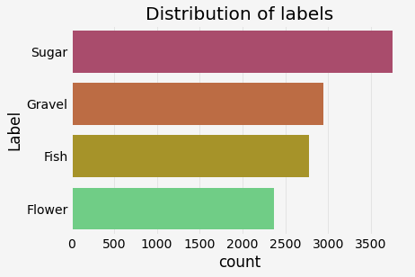
    


Slightly non-uniform distribution, that might bias the model --> To be checked

## Pattern distribution

                 is_mask                  label         label_comb
    image_id                                                      
    0011165.jpg        2         [Fish, Flower]        Fish-Flower
    002be4f.jpg        3  [Fish, Flower, Sugar]  Fish-Flower-Sugar
    0031ae9.jpg        3  [Fish, Flower, Sugar]  Fish-Flower-Sugar
    0035239.jpg        2       [Flower, Gravel]      Flower-Gravel
    003994e.jpg        3  [Fish, Gravel, Sugar]  Fish-Gravel-Sugar
    


    
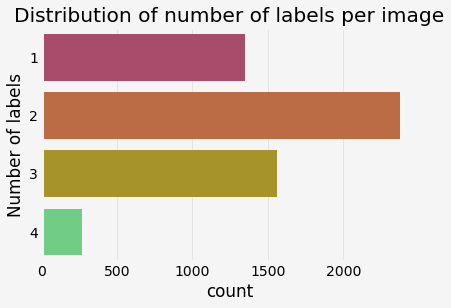
    


4 types of cloud formation in one image is very rare. Only one type of cloud formation in the image is common.


    
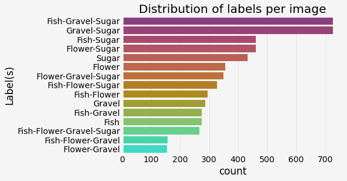
    


All combination of cloud formations appearing together is a possibility, and the combinations between Sugar, Fish, and Gravel are more likely than with Flower cloud formation. We note that sugar appears in 7 of the 8 most frequent patterns.

# Explore Images, masks and their bounding boxes


    
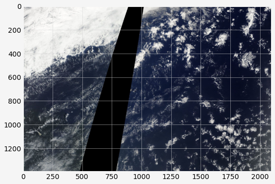
    


    
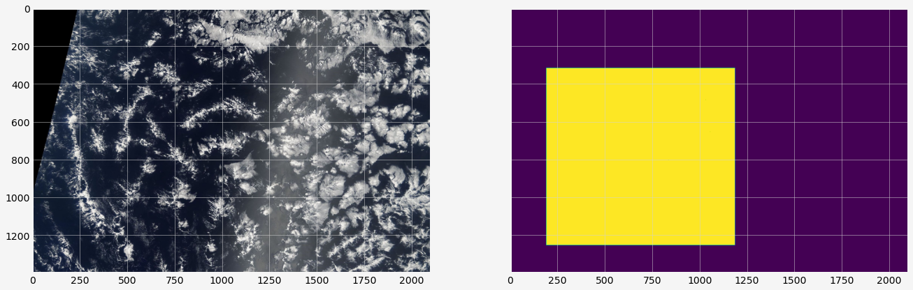
    


As explained in the paper, a mask not outlining the exact clouds but roughly the area with the same kind of patterns. The mask are generally irregular polygons. So the labels might be attached to pixels/part of the picture rather than to the whole image.

## Check cloud patterns

what do they look like?


    
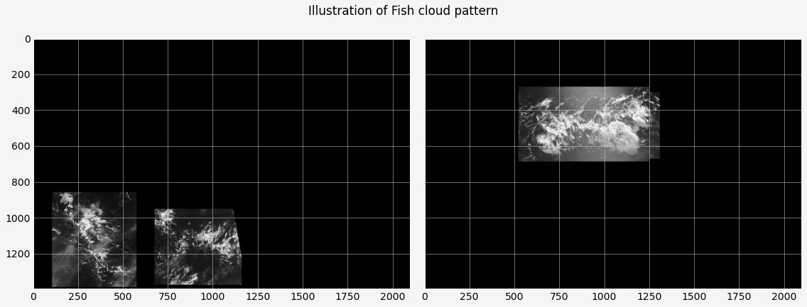
    


    
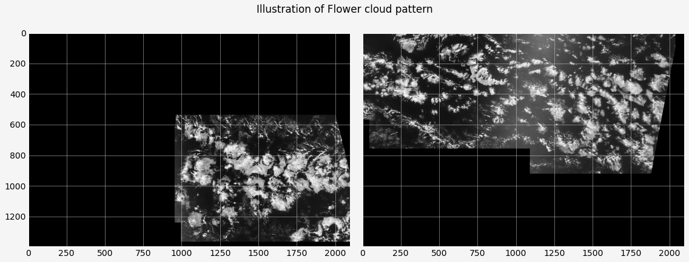
    


    
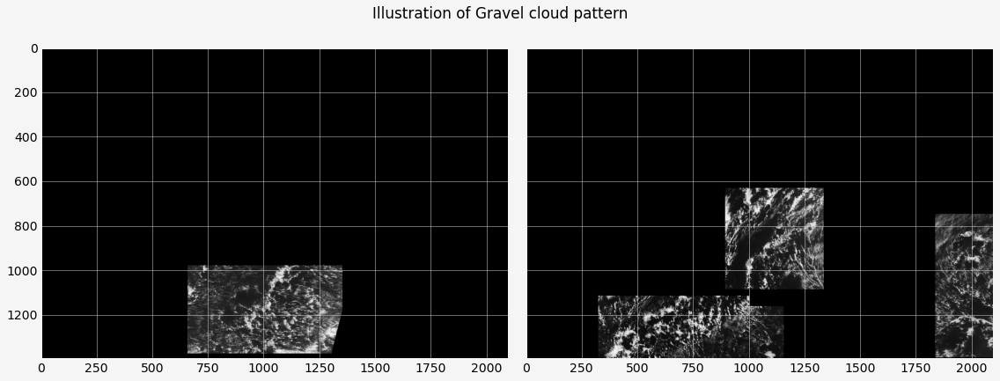
    


    

    


## Difference between mask and bouding box

See if we could use a "bouding-box" version of the mask. Is there a significant overlap? 


    
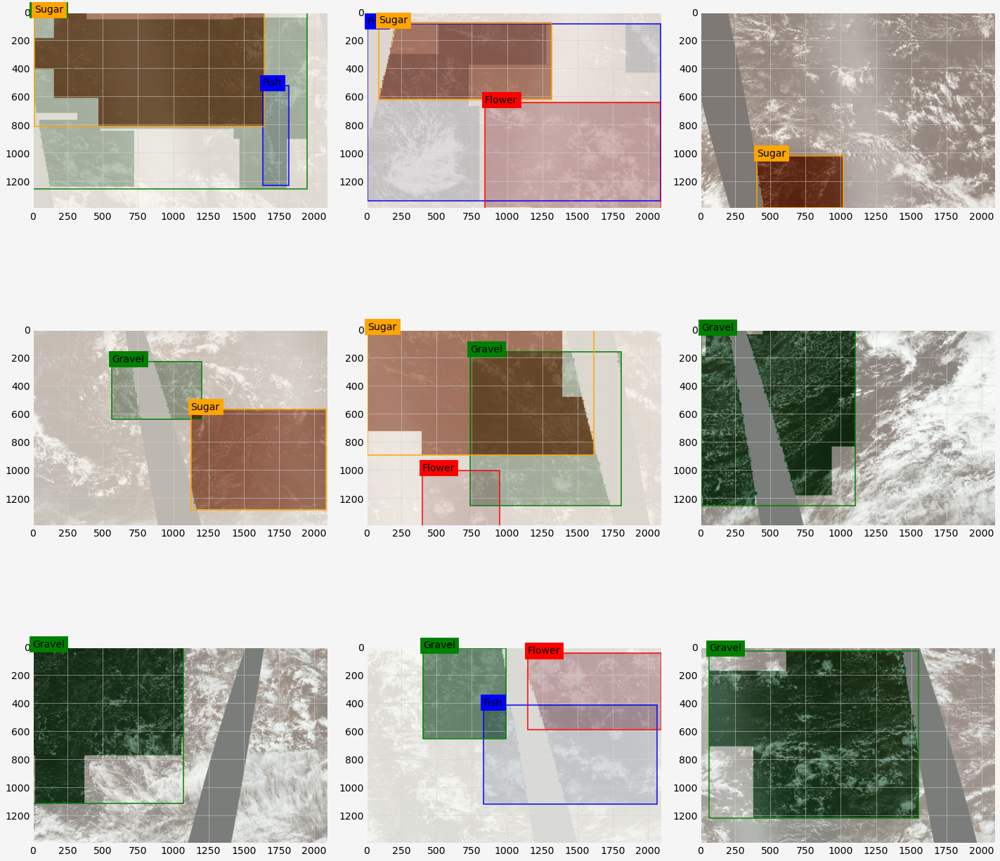
    


# Patterns surface distribution

What is the typical surface of a given cloud formation? Are some of the patterns less extented than others?


    Dask Apply:   0%|          | 0/16 [00:00<?, ?it/s]


    Wall time: 2min 36s
    


    
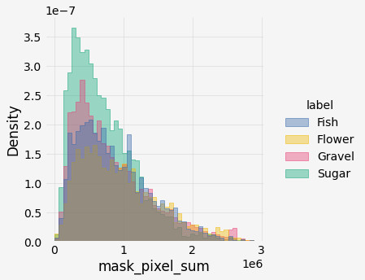
    


    
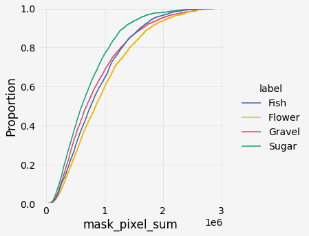
    


It seems that the surface distributions are more or less spanning the same range. Sugar seems to be less extended (higher proba to span smaller area). Is this genuine or due to human labelling.

## Check images resolution and image sharpness (quality)

Check if all the images have the same resolution (size in pixels) and sharpness. The sharpness refers to an image’s overall clarity in terms of both focus and contrast. When the subject of an image is sharp the image appears clear and lifelike, with detail, contrast and texture rendered in high detail. If there are some images with low sharpness, we can filter them out.

    C:\Users\xtbury\Anaconda3\envs\cloudseg\lib\site-packages\swifter\swifter.py:215: UserWarning: Axis keyword not necessary because applying on a Series.
      warnings.warn("Axis keyword not necessary because applying on a Series.")
    


    Pandas Apply:   0%|          | 0/5546 [00:00<?, ?it/s]


<div>
<style scoped>
    .dataframe tbody tr th:only-of-type {
        vertical-align: middle;
    }

    .dataframe tbody tr th {
        vertical-align: top;
    }

    .dataframe thead th {
        text-align: right;
    }
</style>
<table border="1" class="dataframe">
  <thead>
    <tr style="text-align: right;">
      <th></th>
      <th>image_id</th>
      <th>resolution</th>
      <th>sharpness</th>
    </tr>
  </thead>
  <tbody>
    <tr>
      <th>0</th>
      <td>0011165.jpg</td>
      <td>(1400, 2100, 3)</td>
      <td>26.955731</td>
    </tr>
    <tr>
      <th>1</th>
      <td>002be4f.jpg</td>
      <td>(1400, 2100, 3)</td>
      <td>22.866837</td>
    </tr>
    <tr>
      <th>2</th>
      <td>0031ae9.jpg</td>
      <td>(1400, 2100, 3)</td>
      <td>22.968897</td>
    </tr>
    <tr>
      <th>3</th>
      <td>0035239.jpg</td>
      <td>(1400, 2100, 3)</td>
      <td>22.427807</td>
    </tr>
    <tr>
      <th>4</th>
      <td>003994e.jpg</td>
      <td>(1400, 2100, 3)</td>
      <td>24.919619</td>
    </tr>
  </tbody>
</table>
</div>


    The images shape is: [(1400, 2100, 3)]
    

Let's check the sharpness distribution


    
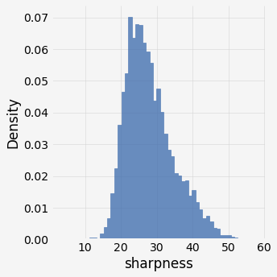
    


    
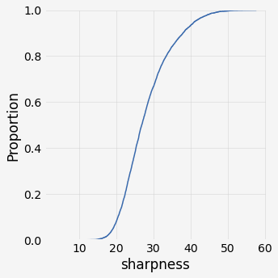
    


    There are 463 (8.35%) images with <20 sharpness
    

Let's take an example to what a low sharpness image looks like


<div>
<style scoped>
    .dataframe tbody tr th:only-of-type {
        vertical-align: middle;
    }

    .dataframe tbody tr th {
        vertical-align: top;
    }

    .dataframe thead th {
        text-align: right;
    }
</style>
<table border="1" class="dataframe">
  <thead>
    <tr style="text-align: right;">
      <th></th>
      <th>image_id</th>
      <th>resolution</th>
      <th>sharpness</th>
    </tr>
  </thead>
  <tbody>
    <tr>
      <th>815</th>
      <td>24884e7.jpg</td>
      <td>(1400, 2100, 3)</td>
      <td>3.307665</td>
    </tr>
    <tr>
      <th>5275</th>
      <td>f32724b.jpg</td>
      <td>(1400, 2100, 3)</td>
      <td>4.914095</td>
    </tr>
    <tr>
      <th>1292</th>
      <td>3b9a092.jpg</td>
      <td>(1400, 2100, 3)</td>
      <td>7.900414</td>
    </tr>
    <tr>
      <th>1795</th>
      <td>5265e81.jpg</td>
      <td>(1400, 2100, 3)</td>
      <td>8.730452</td>
    </tr>
    <tr>
      <th>1399</th>
      <td>400a38d.jpg</td>
      <td>(1400, 2100, 3)</td>
      <td>9.008890</td>
    </tr>
    <tr>
      <th>2264</th>
      <td>6723a7d.jpg</td>
      <td>(1400, 2100, 3)</td>
      <td>10.245062</td>
    </tr>
    <tr>
      <th>2962</th>
      <td>87209c5.jpg</td>
      <td>(1400, 2100, 3)</td>
      <td>10.413785</td>
    </tr>
    <tr>
      <th>529</th>
      <td>17fe76e.jpg</td>
      <td>(1400, 2100, 3)</td>
      <td>11.217400</td>
    </tr>
    <tr>
      <th>2308</th>
      <td>6949408.jpg</td>
      <td>(1400, 2100, 3)</td>
      <td>11.280135</td>
    </tr>
    <tr>
      <th>4294</th>
      <td>c647f73.jpg</td>
      <td>(1400, 2100, 3)</td>
      <td>11.515491</td>
    </tr>
    <tr>
      <th>2440</th>
      <td>6e8b086.jpg</td>
      <td>(1400, 2100, 3)</td>
      <td>12.690771</td>
    </tr>
    <tr>
      <th>5333</th>
      <td>f56bfa6.jpg</td>
      <td>(1400, 2100, 3)</td>
      <td>12.853092</td>
    </tr>
    <tr>
      <th>3858</th>
      <td>b11e1b1.jpg</td>
      <td>(1400, 2100, 3)</td>
      <td>13.053319</td>
    </tr>
    <tr>
      <th>5239</th>
      <td>f189ed1.jpg</td>
      <td>(1400, 2100, 3)</td>
      <td>13.836814</td>
    </tr>
    <tr>
      <th>757</th>
      <td>21b750d.jpg</td>
      <td>(1400, 2100, 3)</td>
      <td>14.132080</td>
    </tr>
    <tr>
      <th>4220</th>
      <td>c2f4b0b.jpg</td>
      <td>(1400, 2100, 3)</td>
      <td>14.360002</td>
    </tr>
    <tr>
      <th>357</th>
      <td>106b15a.jpg</td>
      <td>(1400, 2100, 3)</td>
      <td>14.400241</td>
    </tr>
    <tr>
      <th>5206</th>
      <td>f0188ae.jpg</td>
      <td>(1400, 2100, 3)</td>
      <td>14.596801</td>
    </tr>
    <tr>
      <th>1198</th>
      <td>37266a4.jpg</td>
      <td>(1400, 2100, 3)</td>
      <td>14.667449</td>
    </tr>
    <tr>
      <th>492</th>
      <td>166baf3.jpg</td>
      <td>(1400, 2100, 3)</td>
      <td>14.749182</td>
    </tr>
  </tbody>
</table>
</div>


    
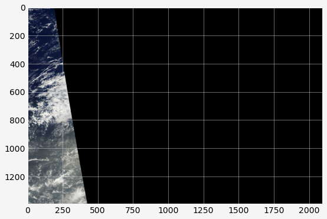
    


    
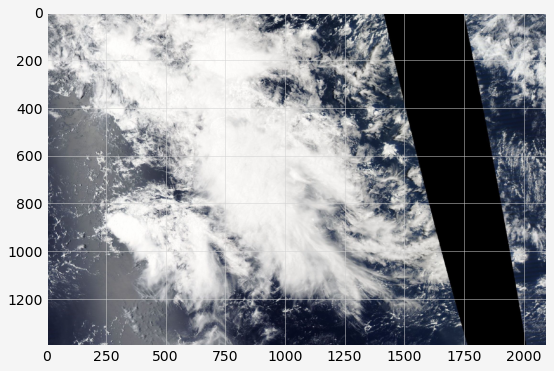
    


Low sharpness images are mostly black or white (wide black stripe due to scanning or a huge cloud). Let's tag them as "bad quality".


<div>
<style scoped>
    .dataframe tbody tr th:only-of-type {
        vertical-align: middle;
    }

    .dataframe tbody tr th {
        vertical-align: top;
    }

    .dataframe thead th {
        text-align: right;
    }
</style>
<table border="1" class="dataframe">
  <thead>
    <tr style="text-align: right;">
      <th></th>
      <th>image_id</th>
      <th>resolution</th>
      <th>sharpness</th>
      <th>quality</th>
    </tr>
  </thead>
  <tbody>
    <tr>
      <th>815</th>
      <td>24884e7.jpg</td>
      <td>(1400, 2100, 3)</td>
      <td>3.307665</td>
      <td>bad</td>
    </tr>
    <tr>
      <th>5275</th>
      <td>f32724b.jpg</td>
      <td>(1400, 2100, 3)</td>
      <td>4.914095</td>
      <td>bad</td>
    </tr>
    <tr>
      <th>1292</th>
      <td>3b9a092.jpg</td>
      <td>(1400, 2100, 3)</td>
      <td>7.900414</td>
      <td>bad</td>
    </tr>
    <tr>
      <th>1795</th>
      <td>5265e81.jpg</td>
      <td>(1400, 2100, 3)</td>
      <td>8.730452</td>
      <td>bad</td>
    </tr>
    <tr>
      <th>1399</th>
      <td>400a38d.jpg</td>
      <td>(1400, 2100, 3)</td>
      <td>9.008890</td>
      <td>bad</td>
    </tr>
    <tr>
      <th>2264</th>
      <td>6723a7d.jpg</td>
      <td>(1400, 2100, 3)</td>
      <td>10.245062</td>
      <td>bad</td>
    </tr>
    <tr>
      <th>2962</th>
      <td>87209c5.jpg</td>
      <td>(1400, 2100, 3)</td>
      <td>10.413785</td>
      <td>bad</td>
    </tr>
  </tbody>
</table>
</div>


Export to parquet and csv for not having to redo the analysis (time consuming).


<div>
<style scoped>
    .dataframe tbody tr th:only-of-type {
        vertical-align: middle;
    }

    .dataframe tbody tr th {
        vertical-align: top;
    }

    .dataframe thead th {
        text-align: right;
    }
</style>
<table border="1" class="dataframe">
  <thead>
    <tr style="text-align: right;">
      <th></th>
      <th>image_label</th>
      <th>encoded_pixels</th>
      <th>image_id</th>
      <th>label</th>
      <th>label_encodedpix</th>
      <th>is_mask</th>
      <th>mask_pixel_sum</th>
      <th>resolution</th>
      <th>sharpness</th>
      <th>quality</th>
    </tr>
  </thead>
  <tbody>
    <tr>
      <th>0</th>
      <td>0011165.jpg_Fish</td>
      <td>264918 937 266318 937 267718 937 269118 937 27...</td>
      <td>0011165.jpg</td>
      <td>Fish</td>
      <td>(Fish, 264918 937 266318 937 267718 937 269118...</td>
      <td>True</td>
      <td>932312.0</td>
      <td>(1400, 2100, 3)</td>
      <td>26.955731</td>
      <td>good</td>
    </tr>
    <tr>
      <th>1</th>
      <td>0011165.jpg_Flower</td>
      <td>1355565 1002 1356965 1002 1358365 1002 1359765...</td>
      <td>0011165.jpg</td>
      <td>Flower</td>
      <td>(Flower, 1355565 1002 1356965 1002 1358365 100...</td>
      <td>True</td>
      <td>1156107.0</td>
      <td>(1400, 2100, 3)</td>
      <td>26.955731</td>
      <td>good</td>
    </tr>
    <tr>
      <th>2</th>
      <td>0011165.jpg_Gravel</td>
      <td>NaN</td>
      <td>0011165.jpg</td>
      <td>Gravel</td>
      <td>(Gravel, nan)</td>
      <td>False</td>
      <td>NaN</td>
      <td>(1400, 2100, 3)</td>
      <td>26.955731</td>
      <td>good</td>
    </tr>
    <tr>
      <th>3</th>
      <td>0011165.jpg_Sugar</td>
      <td>NaN</td>
      <td>0011165.jpg</td>
      <td>Sugar</td>
      <td>(Sugar, nan)</td>
      <td>False</td>
      <td>NaN</td>
      <td>(1400, 2100, 3)</td>
      <td>26.955731</td>
      <td>good</td>
    </tr>
    <tr>
      <th>4</th>
      <td>002be4f.jpg_Fish</td>
      <td>233813 878 235213 878 236613 878 238010 881 23...</td>
      <td>002be4f.jpg</td>
      <td>Fish</td>
      <td>(Fish, 233813 878 235213 878 236613 878 238010...</td>
      <td>True</td>
      <td>1684325.0</td>
      <td>(1400, 2100, 3)</td>
      <td>22.866837</td>
      <td>good</td>
    </tr>
  </tbody>
</table>
</div>


# Converting the notebook to Markdown

    C:\Users\xtbury\Anaconda3\envs\cloudseg\lib\site-packages\traitlets\traitlets.py:2202: FutureWarning: Supporting extra quotes around strings is deprecated in traitlets 5.0. You can use 'C:/Users/xtbury/Documents/Projects/Pyreidolia/reports/' instead of "'C:/Users/xtbury/Documents/Projects/Pyreidolia/reports/'" if you require traitlets >=5.
      warn(
    [NbConvertApp] Converting notebook eda.ipynb to markdown
    [NbConvertApp] Support files will be in eda_files\
    [NbConvertApp] Making directory C:/Users/xtbury/Documents/Projects/Pyreidolia/reports/eda_files
    [NbConvertApp] Making directory C:/Users/xtbury/Documents/Projects/Pyreidolia/reports/eda_files
    [NbConvertApp] Making directory C:/Users/xtbury/Documents/Projects/Pyreidolia/reports/eda_files
    [NbConvertApp] Making directory C:/Users/xtbury/Documents/Projects/Pyreidolia/reports/eda_files
    [NbConvertApp] Making directory C:/Users/xtbury/Documents/Projects/Pyreidolia/reports/eda_files
    [NbConvertApp] Making directory C:/Users/xtbury/Documents/Projects/Pyreidolia/reports/eda_files
    [NbConvertApp] Making directory C:/Users/xtbury/Documents/Projects/Pyreidolia/reports/eda_files
    [NbConvertApp] Making directory C:/Users/xtbury/Documents/Projects/Pyreidolia/reports/eda_files
    [NbConvertApp] Making directory C:/Users/xtbury/Documents/Projects/Pyreidolia/reports/eda_files
    [NbConvertApp] Making directory C:/Users/xtbury/Documents/Projects/Pyreidolia/reports/eda_files
    [NbConvertApp] Making directory C:/Users/xtbury/Documents/Projects/Pyreidolia/reports/eda_files
    [NbConvertApp] Making directory C:/Users/xtbury/Documents/Projects/Pyreidolia/reports/eda_files
    [NbConvertApp] Making directory C:/Users/xtbury/Documents/Projects/Pyreidolia/reports/eda_files
    [NbConvertApp] Making directory C:/Users/xtbury/Documents/Projects/Pyreidolia/reports/eda_files
    [NbConvertApp] Making directory C:/Users/xtbury/Documents/Projects/Pyreidolia/reports/eda_files
    [NbConvertApp] Making directory C:/Users/xtbury/Documents/Projects/Pyreidolia/reports/eda_files
    [NbConvertApp] Writing 19773 bytes to C:\Users\xtbury\Documents\Projects\Pyreidolia\reports\eda.md
    


    'C:/Users/xtbury/Documents/Projects/Pyreidolia/reports/'


